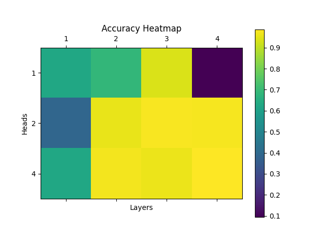
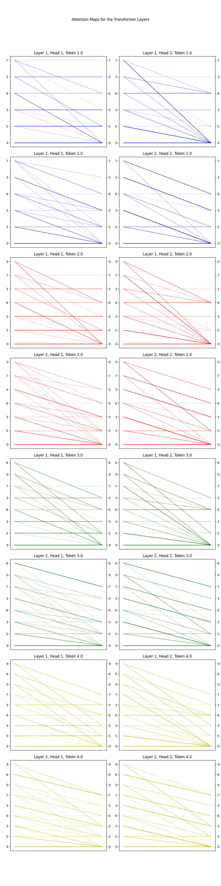
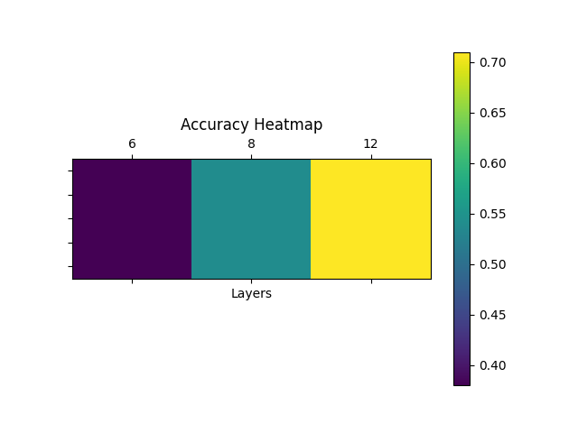

# MathGPT
## nanoGPT trained to add and multiply numbers

### Rafał Leja

---

## This project has two goals:

#### - Add two numbers with the smallest possible model size, and visualize the model

#### - Multiply two numbers with the smallest possible model size, with Chain-Of-Thought

---

## Addition

#### - The model was trained on randomly generated pairs of 3 digit positive numbers, with padding, so that the digits of the numbers are aligned

#### - Models trained with different number of heads and layers, with embedding size of 128

### Results:

### Visualization:

---

## Multiplication

#### - The model was trained on randomly generated pairs of 3 digit positive numbers, without padding, with additional tokens for Chain-Of-Thought

#### - Models trained with different number of layers, with embedding size of 256 and 8 heads

### Results:

