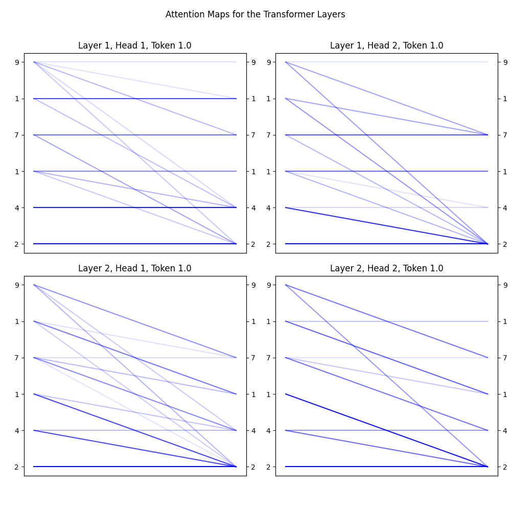
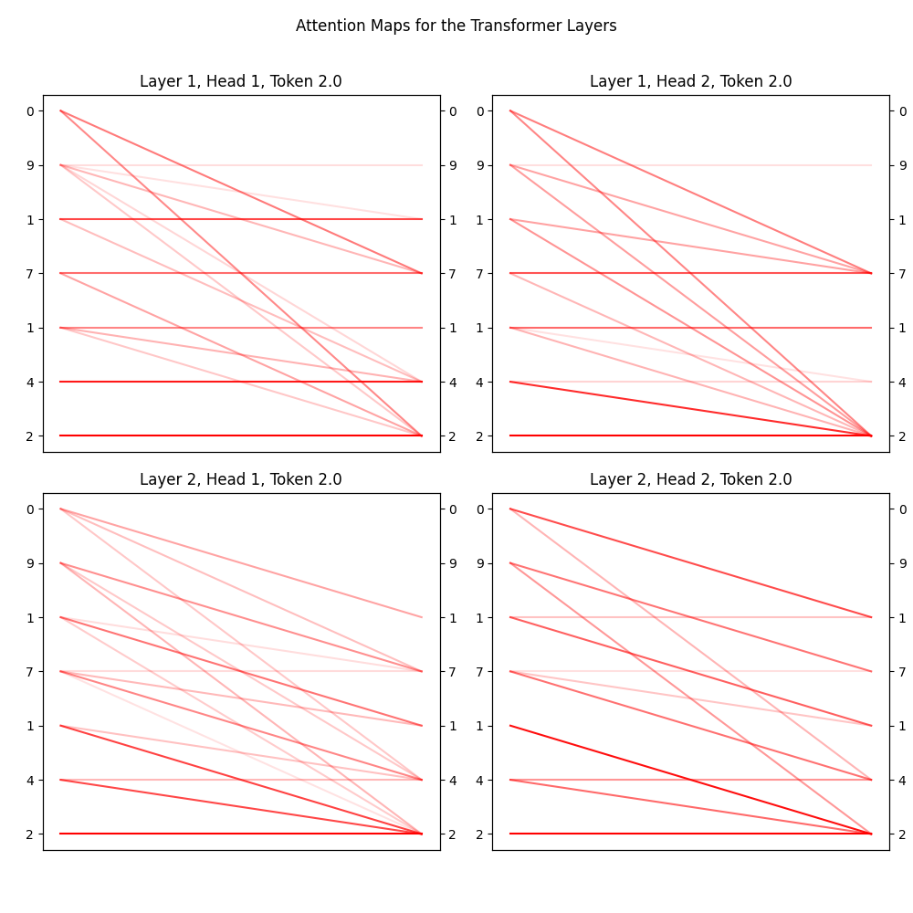
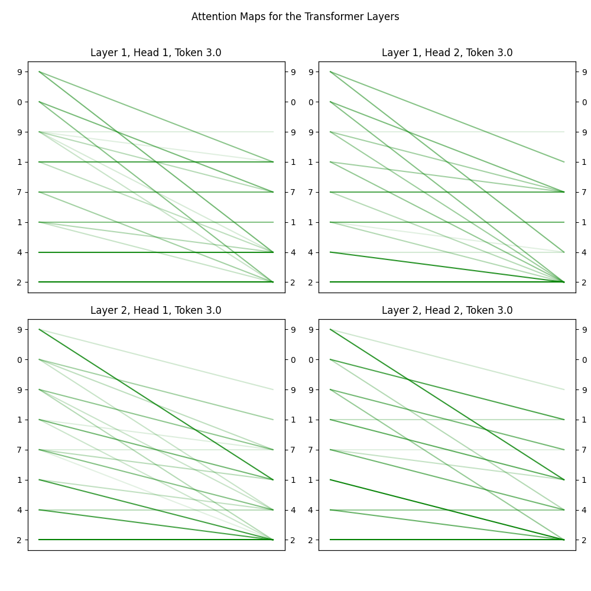
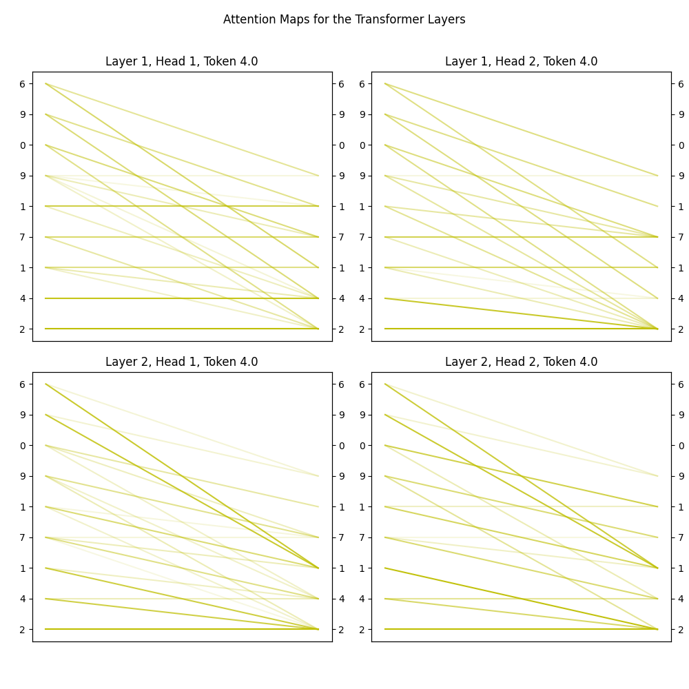

# MathGPT -> AddGPT

### How transformers add numbers?

Rafał Leja

--- 

# Task

### - Add two numbers

### - Minimize model size

### - Visualize the model

---

# Data

### - Randomly generated pairs of 3 digit positive numbers

---

# Models:

### Heads = 1, 2, 4

### Layers = 1, 2, 3, 4

### Embedding size = 128

---

# Results


---

### Visualization



---



---



---



---
 
# Bonus task

### - Multiply two numbers, without padding, using Chain-Of-Thought

---

# Models:

### Heads = 8

### Layers = 6, 8, 12

### Embedding size = 256

---

# Example

```python
Prompt: 972*220=

Tokens: [10,  9,  7,  2, 11, 12, 10,  2,  2,  0, 11, 14, 15]

Model: 972*220=900*220+70*220+2*220=198000+15400+440=213840
```

---

# Results

